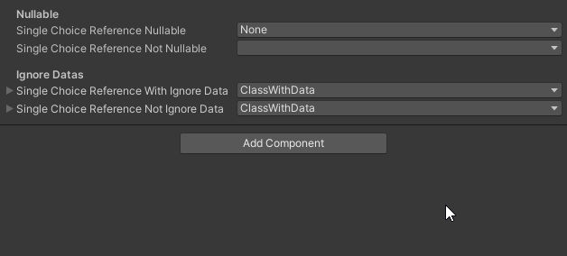

# ChoiceReferenceAttribute
This package allows you to use the [ChoiceReference] attribute to make a popup interaction to select a subclass from which the base class that you specified as the field type inherits. Lists and arrays are also supported, as is the fact that this attribute will be used again in subclasses.

[Документация на русском](Documentation~/RU.md)

## Add to project
To add this package to the project, follow these steps:
1) Open PackageManager;
2) Select "Add package from get URL";
3) Insert links to packages that are dependencies of this package:
    + `https://github.com/Paulsams/MiscUtilities.git`
4) Insert this link `https://github.com/Paulsams/ChoiceReferenceAttribute.git`

## Related Packages
1) RepairerSerializeReferences (so far only from 2021.2) - an editor window that allows you to fix links that flew due to a change in the name of the class, namespace, or assembly: https://github.com/Paulsams/RepairerSerializeReferences

## Dependencies
- Is using:
    + MicsUtilities: https://github.com/Paulsams/MiscUtilities.git

# Known Issues
1) When editing objects multiple times and pressing the `-` button on a sheet/array (and only if this is not an SR array, but they are nested through other classes), errors may appear. There are no ideas yet, since the messages don’t even have a stack trace, but otherwise multiple editing works correctly.

## Opportunities
1) Works for lists/array and for any nesting of this attribute;

IMPORTANT: In order for the attribute to work for lists/array, it is necessary to add `[System.Serializable]` to the base class. Don't ask me why - that's life:

```cs
[SerializeReference, ChoiceReference] private BaseClass _singleChoiceReference;
[SerializeReference, ChoiceReference] private List<BaseClass> _listChoiceReferences;
```


2) You can specify the nullable flag in the parameters attribute, which allows you to remove the "null" state from the selection for the object. If it is "false" (and this is the default value), then you will still need to select the type for the first time, otherwise there would be recursion if there is a field with the same attribute in the object.

```cs
[SerializeReference, ChoiceReference(true)] private BaseClass _singleChoiceReferenceNullable;
[SerializeReference, ChoiceReference] private BaseClass _singleChoiceReferenceNotNullable;
```



3) ISerializeReferenceChangeValidate - an interface that you can implement at the heir in order to make some kind of check that the Type change is valid at the moment.
4) When you click on `+` for lists, serialize references (nested through an additional class) are not copied (I have not yet seen this in any implementation of field attributes);
5) Multiple object editing available.

## Constructors
```cs
ChoiceReferenceAttribute(bool nullable)
```

## Samples
To download the examples for this package:
1) Select this package in PackageManager;
2) Expand the "Samples" tab on the right;
3) And click the "Import" button on the example you are interested in.
